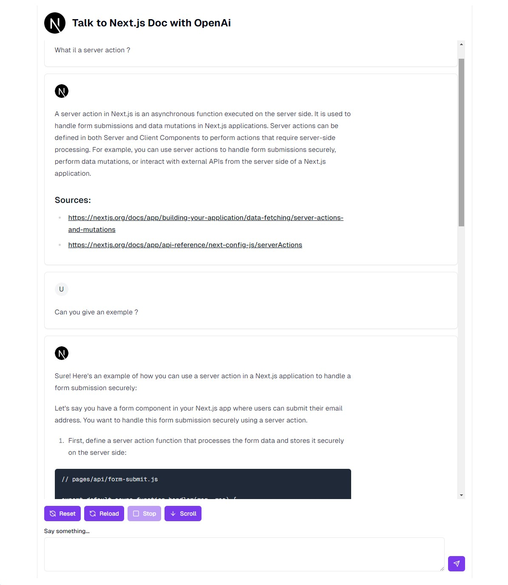

This is a chatbot boost with Ai for talk with the [Next.js](https://nextjs.org/) documentation. You can test 10 requests for 10 minutes on [`www.talktonextjsdoc.henriteinturier.com`](https://www.talktonextjsdoc.henriteinturier.com/)

## Getting Started

First you need to scrap the Next.js documentation and store embedding data in a vector database. You can check this repo: [`https://github.com/HenriTeinturier/ScrapEmbeddingNextjsDoc`](https://github.com/HenriTeinturier/ScrapEmbeddingNextjsDoc)

You need a vector database and a openai api key.
Then you need to create a .env as the .env.exemple and complete with your openai api key and your vector database url.

````bash

run the development server:

```bash
npm run dev
# or
yarn dev
# or
pnpm dev
# or
bun dev
````

Open http://localhost:3000 with your browser to see the result or go to [`www.talktonextjsdoc.henriteinturier.com`](https://www.talktonextjsdoc.henriteinturier.com/)

 
